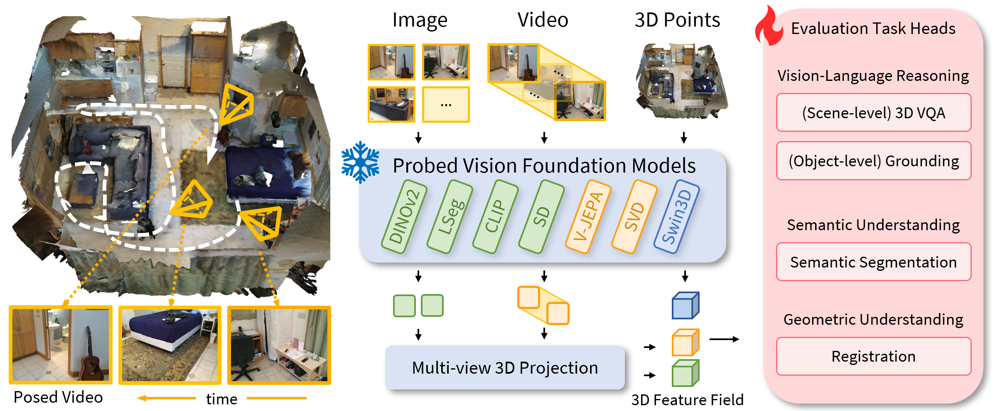

# Lexicon3D: Probing Visual Foundation Models for Complex 3D Scene Understanding

<a href="https://yunzeman.github.io/" style="color:blue;">Yunze Man</a> ·
<a href="https://zsh2000.github.io/" style="color:blue;">Shuhong Zheng</a> ·
<a href="https://zpbao.github.io/" style="color:blue;">Zhipeng Bao</a> ·
<a href="http://www.cs.cmu.edu/~hebert" style="color:blue;">Martial Hebert</a> ·
<a href="https://cs.illinois.edu/about/people/department-faculty/lgui" style="color:blue;">Liang-Yan Gui</a> ·
<a href="https://yxw.web.illinois.edu/" style="color:blue;">Yu-Xiong Wang</a>

[NeurIPS 2024] [[`Project Page`](https://yunzeman.github.io/lexicon3d/)] [[`arXiv`](http://arxiv.org/abs/2409.03757)] [[`pdf`](https://arxiv.org/pdf/2409.03757)] [[`BibTeX`](#BibTex)]

[](https://pytorch.org/) [](http://arxiv.org/abs/2409.03757) [](https://yunzeman.github.io/lexicon3d/) [](https://github.com/YunzeMan/Lexicon3D) [](https://opensource.org/licenses/MIT)

This repository contains the official PyTorch implementation of the paper "Lexicon3D: Probing Visual Foundation Models for Complex 3D Scene Understanding". The paper is available on [arXiv](http://arxiv.org/abs/2409.03757). The project page is online at [here](https://yunzeman.github.io/lexicon3d/). This work is accepted by NeurIPS 2024.


## About


We design a unified framework, as shown in the Figure above, to extract features from different foundation models, construct a 3D feature embedding as scene embeddings, and evaluate them on multiple downstream tasks. For a complex indoor scene, existing work usually represents it with a combination of 2D and 3D modalities. Given a complex scene represented in posed images, videos, and 3D point clouds, we extract their feature embeddings with a collection of vision foundation models. For image- and video-based models, we project their features into 3D space for the subsequent 3D scene evaluation tasks with a multi-view 3D projection module. <br><br>

We also visualize the scene features extracted by the vision foundation models.

## BibTeX
If you use our work in your research, please cite our publication:
```bibtex
@inproceedings{man2024lexicon3d,
      title={Lexicon3D: Probing Visual Foundation Models for Complex 3D Scene Understanding},
      author={Man, Yunze and Zheng, Shuhong and Bao, Zhipeng and Hebert, Martial and Gui, Liang-Yan and Wang, Yu-Xiong},
      booktitle={Advances in Neural Information Processing Systems},
      year={2024} 
      }
```


## News
* `09/25/2024`: Our paper is accepted by [NeurIPS 2024](https://neurips.cc/Conferences/2024/).
* `09/05/2024`: Release the foundation model feature extraction and fusion scripts.
* `06/24/2024`: GitHub page initialization.

## Environment Setup

Please install the required packages and dependencies according to the `requirements.txt` file. 

In addition, 
- in order to use the LSeg model, please follow [this repo](https://github.com/pengsongyou/lseg_feature_extraction) to install the necessary dependencies.
- in order to use the Swin3D model, please follow [this repo](https://github.com/microsoft/Swin3D) and [this repo](https://github.com/Yukichiii/Swin3D_Task) to install the necessary dependencies.

Finally, please download the ScanNet dataset from the official website and follow the instructions [here](https://github.com/pengsongyou/openscene/blob/main/scripts/preprocess) to preprocess the ScanNet dataset and get RGB video frames and point clouds for each scannet scene.

## Feature Extraction

To extract features from the foundation models, please run the corresponding scripts in the `lexicon3d` folder. For example, to extract features from the LSeg model, please run the following command:

```bash
python fusion_scannet_clip.py  --data_dir dataset/ScanNet/openscene/  --output_dir  dataset/lexicon3d/clip/ --split train --prefix clip
```

This script will extract features from the LSeg model for the ScanNet dataset. The extracted features will be saved in the `output_dir` folder, containing the feature embeddings, points, and voxel grids.

## TODO
- [x] Evaluation (partial)
- [x] Feature visualization
- [x] Feature extraction
- [x] GitHub page initialization


## Acknowledgements
This repo is built based on the fantastic work [OpenScene](https://github.com/pengsongyou/openscene). We also thank the authors of [P3DA](https://github.com/mbanani/probe3d) and the authors of all relevant visual foundation models for their great work and open-sourcing their codebase. 
