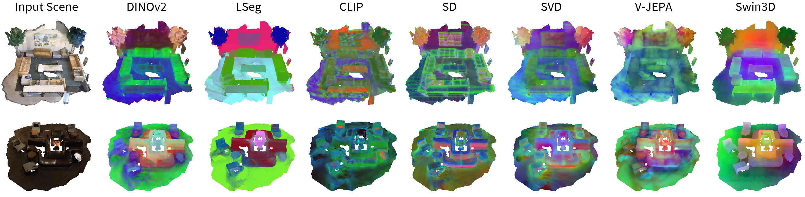

# Lexicon3D: Probing Visual Encoding Models for Complex 3D Scene Understanding

<a href="https://yunzeman.github.io/" style="color:blue;">Yunze Man</a> ·
<a href="https://zsh2000.github.io/" style="color:blue;">Shuhong Zheng</a> ·
<a href="https://zpbao.github.io/" style="color:blue;">Zhipeng Bao</a> ·
<a href="http://www.cs.cmu.edu/~hebert" style="color:blue;">Martial Hebert</a> ·
<a href="https://cs.illinois.edu/about/people/department-faculty/lgui" style="color:blue;">Liang-Yan Gui</a> ·
<a href="https://yxw.web.illinois.edu/" style="color:blue;">Yu-Xiong Wang</a>

[arXiv Preprint] [[`Project Page`](https://yunzeman.github.io/lexicon3d/)] [[`arXiv`](https://arxiv.org/abs/)] [[`pdf`](https://yunzeman.github.io/lexicon3d/)] [[`BibTeX`](#BibTex)]

[](https://pytorch.org/) [](https://arxiv.org/) [](https://yunzeman.github.io/lexicon3d/) [](https://github.com/YunzeMan/Lexicon3D) [](https://opensource.org/licenses/MIT)

This repository contains the official PyTorch implementation of the paper "Lexicon3D: Probing Visual Encoding Models for Complex 3D Scene Understanding". The paper is available on [arXiv](https://arxiv.org/abs/2406.07544). The project page is online at [here](https://yunzeman.github.io/situation3d/).


## About


We design a unified framework, as shown in the Figure above, to extract features from different foundation models, construct a 3D feature embedding as scene embeddings, and evaluate them on multiple downstream tasks. For a complex indoor scene, existing work usually represents it with a combination of 2D and 3D modalities. Given a complex scene represented in posed images, videos, and 3D point clouds, we extract their feature embeddings with a collection of vision foundation models. For image- and video-based models, we project their features into 3D space for the subsequent 3D scene evaluation tasks with a multi-view 3D projection module. <br><br>

We also visualize the scene features extracted by the vision foundation models in Figure below.


## News
* `06/24/2024`: GitHub page initialization.

## TODO
- [ ] Document Completion
- [ ] Feature Extraction
- [ ] Evaluation and Visualization


## BibTeX
If you use our work in your research, please cite our publication:
```bibtex
@article{man2024lexicon3d,
      title={Lexicon3D: Probing Visual Encoding Models for Complex 3D Scene Understanding},
      author={Man, Yunze and Zheng, Shuhong and Bao, Zhipeng and Hebert, Martial and Gui, Liang-Yan and Wang, Yu-Xiong},
      journal={arXiv preprint},
      year={2024} 
      }
```

## Acknowledgements
This repo is built based on the fantastic work [OpenScene](https://github.com/pengsongyou/openscene). We thank the authors for their great work and open-sourcing their codebase. 
